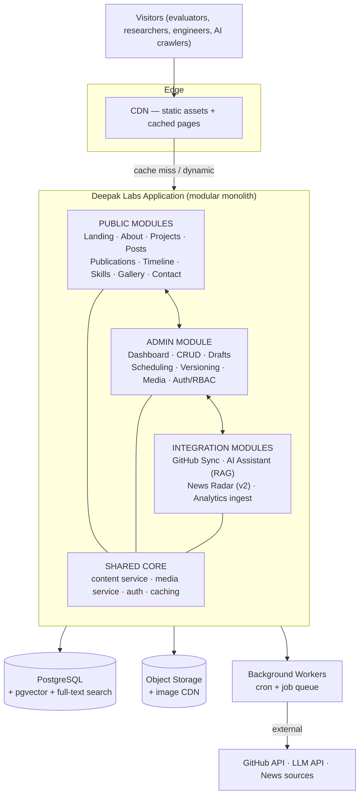
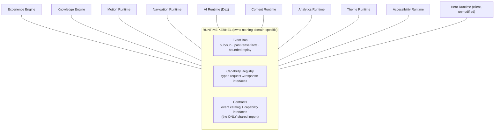
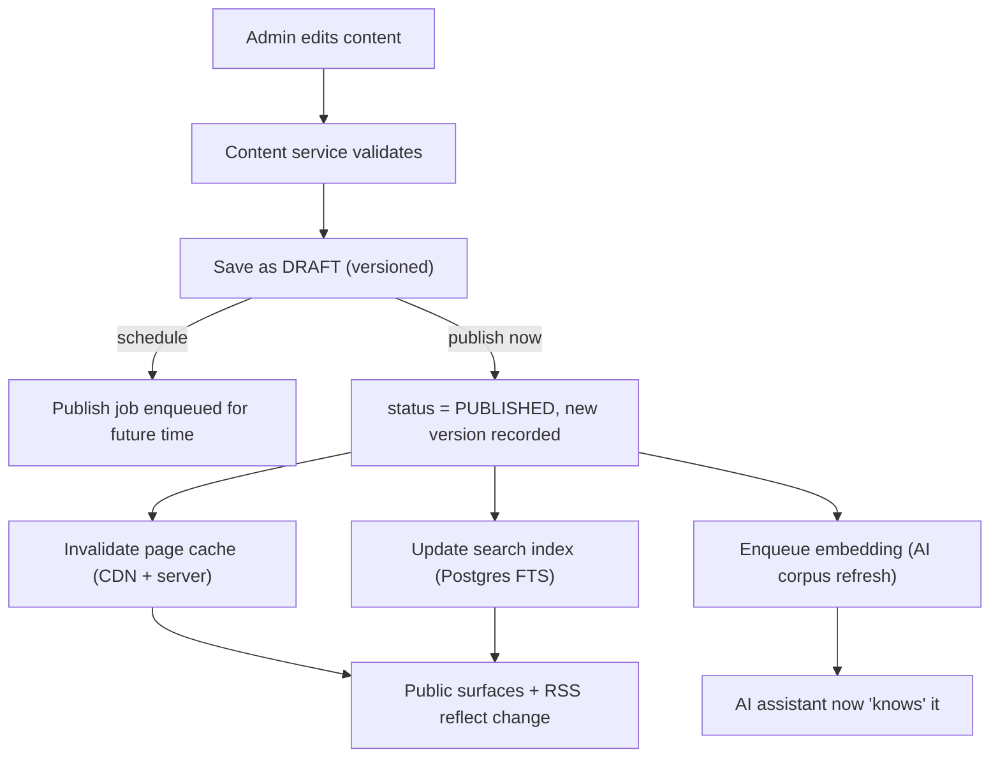
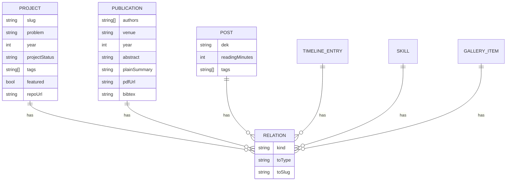
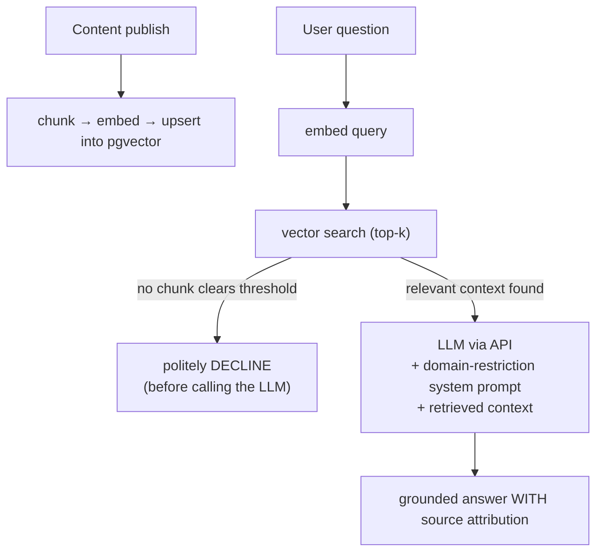
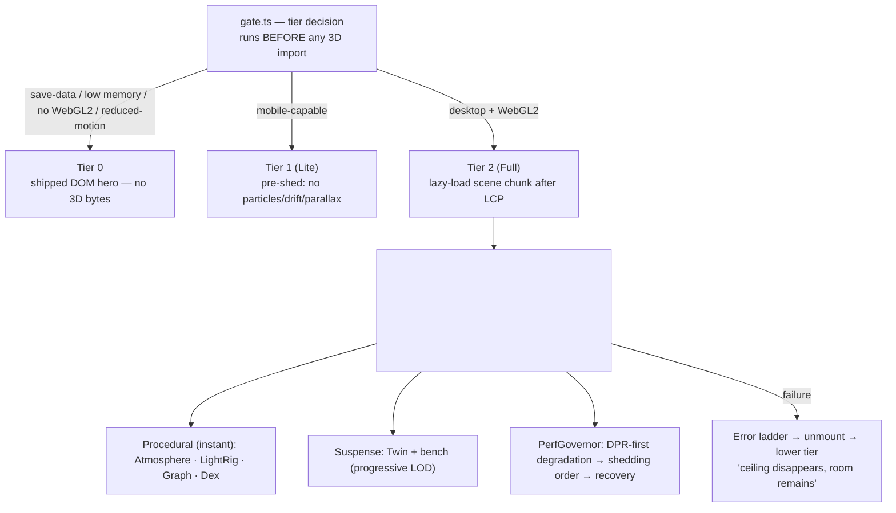

# Architecture — Deepak Labs

> Generated from the repository's system-architecture doc (`docs/11`), the Personal OS Runtime spine (`docs/23`), the hero runtime (`docs/22`), the tech-stack ratification (`docs/06`), and the shipped `apps/web` source. Diagrams are Mermaid (render on GitHub). A standalone visual catalog lives in [`DIAGRAMS.md`](DIAGRAMS.md).

---

## 0. The governing constraint

Every decision below descends from one line in the PRD, not from a scaling target:

> **One maintainer. One decade. One personal budget.**

This produces two rules that recur throughout the system:

1. **Fewest moving parts that cleanly satisfy the requirements.** Every service, database, and vendor is a recurring cost in money and attention; complexity must earn its place.
2. **Decide expensive-to-reverse things early; defer cheap-to-reverse things.** The data model and module boundaries are locked now; the hosting vendor and exact accent hue are deferred until evidence forces the call.

---

## 1. System shape — a modular monolith

One deployable application, internally partitioned into strongly-bounded modules that map to content types and capabilities. Background work (GitHub sync, embeddings, news ingestion) runs as idempotent scheduled jobs on the same codebase and datastore.



**Why a modular monolith, not microservices.** Clean internal boundaries give the maintainability and extensibility the constraints demand, without the operational tax of microservices (multiple deploys, network hops, distributed debugging). Modules talk through in-process interfaces, so any module can later be *extracted* into its own service — a refactor along an existing seam, not a rewrite. Rejected alternatives: microservices-from-day-one (ops surface for zero benefit at this scale), static-site-plus-SaaS-CMS (rents the canonical asset), serverless-as-primary (cold starts hurt the 90-second goal; long jobs fit workers better).

---

## 2. The two-plane kernel — the Personal OS runtime spine

Above the module map sits the project's most distinctive architectural idea (`docs/23`, D-038): the product stops behaving as a stack of pages and becomes a set of **runtimes coordinated by a tiny kernel**. Crucially, the kernel exposes **two** communication planes — a deliberate override of the original brief's "communicate only through an Event Bus" instruction.



**The two planes, and why both exist:**

| Plane | Shape | For | Coupling |
| --- | --- | --- | --- |
| **Event Bus** | pub/sub, fire-and-forget, past-tense facts | choreography, notifications, side-effects | many→many, anonymous |
| **Capability Registry** | typed request→response interfaces | queries, reads, commands-with-results | consumer→*interface*, not provider |

A pure event bus is correct for *notifications* and wrong for *queries*: forcing search, retrieval, and relation-lookups through fire-and-forget messaging demands correlation-ID plumbing and invites races — exactly the unnecessary complexity the PRD forbids. The brief's *real* requirement — "no module directly depends on another" — is satisfied literally: **modules import only kernel-owned contracts**, never each other. What changed is that "depends on the kernel" now covers two mechanisms.

### The ten runtimes

Each runtime declares: what it owns, what it publishes/subscribes, what capability it exposes/consumes, and a **degraded mode**.

| Runtime | Responsibility | Exposes | Degrades to |
| --- | --- | --- | --- |
| **Experience Engine** | Orchestrates transitions and the narrative arc | — | Instant route commits, no choreography |
| **Knowledge Engine** | Graph, search index, RAG retrieval index (projections over content) | `IKnowledgeQuery`, `IRetrieval` | Last-good projection; `Unavailable` → static routes |
| **Motion Runtime** | The *one* owner of scroll/cursor/gesture; motion budget | timeline handles, continuous refs | All tokens resolve to static equivalents |
| **Navigation Runtime** | Command palette, global search, routing, Dex hand-off | `INavigate` | Static route list; native links always work |
| **AI Runtime (Dex)** | Conversation, retrieval orchestration, citations (v1.5) | `IDexSession` | "Resting" — entry points quietly reduce |
| **Content Runtime** | System of record; publish lifecycle | `IContentRead` | Last successful build/ISR snapshot |
| **Analytics Runtime** | Privacy-respecting, aggregate journeys (pure subscriber) | admin query (later) | Always droppable — invisible to visitors |
| **Theme Runtime** | Light/dark/system, daypart lighting, token values | `IThemeState` | Default light mode, static tokens |
| **Accessibility Runtime** | Reduced-motion, keyboard mode, focus orchestration | `IA11yState` | **Never degrades — it is the floor** |
| **Event Bus** | The substrate the other nine stand on | (kernel-internal) | — |

**Two laws make this enforceable:**

- **The single-writer law** — exactly one runtime writes any given datum; everyone else reads via capability or reacts to events. This is the bug class the architecture exists to prevent.
- **The floor principle** (generalized from the hero) — every runtime degrades to a designed lesser state; the DOM content plane is the permanent floor. *"The ceiling disappears; the room remains."* Accessibility is the one runtime with no lesser mode.

**Honest adoption note.** This OS is a *target skeleton adopted incrementally* (`docs/23` §11), **not** a rewrite of shipped code. Today its "runtimes" are embryos — `ui-store`, `hero-store`, `next-themes`, `MotionConfig`, the `ContentService` interface. New modules (Dex, News, Admin) are born OS-native; existing stores become runtime faces by rename-and-formalize. Premature kernelization would itself violate the one-maintainer constraint.

---

## 3. Data flow — "write once, surface everywhere"

The product's heartbeat is the ≤10-minute content-update loop. A single admin action fans out to every surface; content-entry is never duplicated.



**Read path** favors the edge: most public traffic is served as static/SSG pages from the CDN; a cache miss renders via SSG-with-revalidation or SSR, reading from Postgres and the cached GitHub data. Public content is mostly read-only, so the caching strategy is: **cache aggressively at the edge, invalidate precisely on the publish event** (never blind TTLs for content).

---

## 4. The content graph — the real data model

The shipped TypeScript content model (`apps/web/src/types/content.ts`) *is* the contract the database will implement. Content is inherently relational, which is why a relational store was chosen; the cross-links are modeled as typed relations, not duplicated content.



The relation set is **closed** — additions require a logged decision:

`implements` (project → publication) · `writes-about` (post → project/publication) · `produced` (timeline → any) · `evidences` (skill → project/publication/post) · `depicts` (gallery → any) · `references` (any → any, used sparingly).

Every content item shares a spine: `slug · title · status · publishedAt · updatedAt · relations[]`. In the database this becomes a `content_items` table with per-type field tables, `content_versions` for full history, and a `relations(from_id, to_id, kind)` edge table.

---

## 5. AI architecture — RAG with absolute domain restriction

The assistant, **Dex**, answers *only* from Deepak's corpus, never fabricates, and cites its sources. Domain restriction is enforced in three layers, the first being the most important:



1. **Retrieval gating** — if nothing clears the relevance threshold, Dex declines *before* the LLM is even called. This is the primary, most reliable guard and it also caps cost.
2. **System prompt** — answer only from provided context, never fabricate, decline off-topic.
3. **Optional lightweight classifier** — added only if gating proves insufficient.

Vectors live in `pgvector` **inside the same PostgreSQL** — one database backs content, search, *and* the AI corpus, eliminating two services a solo maintainer would otherwise operate. Rejected: fine-tuning (expensive, stale on every edit, prone to hallucination — RAG updates instantly and cites); a dedicated vector DB (deferred behind a swappable retrieval interface). Knowledge updates are **event-driven** — publish enqueues re-embedding, so the corpus is always a faithful projection of published content.

---

## 6. The hero runtime — a heavy feature engineered as a pure enhancement

The most technically ambitious shipped surface is the interactive 3D hero (`features/hero-scene`, React Three Fiber). Its entire architecture descends from one principle:

> **The page is complete before the canvas exists, and remains complete if the canvas dies.**



Engineering highlights, all verified in the shipped foundation (D-037):

- **The tier gate decides before a single 3D byte downloads.** A cheap WebGL2 probe, `save-data`, `deviceMemory`, and `prefers-reduced-motion` route the visitor. Verified result: **three.js is absent from every route's First Load JS** — the lazy, tier-gated chunk works.
- **Three state domains, three mechanisms** (`docs/22` §4): *continuous* values (scroll %, pointer, camera) live in **mutable refs read in `useFrame` — never React state** (60fps through `setState` is the classic R3F failure); *discrete* interaction lives in a Zustand `hero-store`; *content* is server props (the graph is real data, static per deploy).
- **The graph renders in 2 draw calls** — one `InstancedMesh` for ≤150 nodes (per-instance attributes for position/luminance/halo), one merged geometry for edges.
- **The error ladder is the error architecture.** Every failure (GLB parse, WebGL context loss, chunk load failure, thermal collapse) resolves to a *lesser tier that was already a designed experience*. No error state is ever shown.
- **Reduced motion is designed, not degraded** — the scene collapses to five composed keyframe "stations," ambient systems are *unmounted* (their memory returns), and the frameloop switches to `demand`.

The 3D Twin assets themselves are pipelined (Blender handbook, art direction, moodboard all ratified) but gated on owner reference photos — so the runtime ships with primitive stand-ins, and **every future object is a swap, not a rework**.

---

## 7. Backend services & operational strategy (architected)

| Concern | Decision | Rationale |
| --- | --- | --- |
| **Datastore** | Single PostgreSQL (system of record) + `pgvector` + FTS | Relational content; ACID lifecycle; one system covers store + search + vectors |
| **Search** | Postgres FTS first, behind a `SearchIndex` interface | Zero extra infra for a personal corpus; swap to a dedicated engine only on evidence |
| **Media** | Object storage for originals + image CDN for delivery | Never blobs in the DB; edge-optimized variants |
| **GitHub** | Cached in DB via scheduled refresh (not live per request) | Resilience — GitHub's availability must not gate the site's; rate-limit safe |
| **Auth** | Single strong admin identity; RBAC schema dormant | No visitor accounts (a PRD non-goal); multi-role is a later data/UI add, not a re-architecture |
| **Hosting** | Managed PaaS + managed Postgres + object storage/CDN | For one maintainer, operational simplicity *is* the feature; portable, no k8s |
| **News (v2)** | A plain scheduled worker + one table | The only feature with a recurring weekly obligation — kept deliberately minimal |

**Security posture** is proportionate to a public content site with one privileged admin and an AI cost surface: HTTPS/HSTS/CSP everywhere; Markdown→HTML sanitization (the primary CMS XSS vector); parameterized queries; **hard cost caps + rate limiting on the AI endpoint**; prompt-injection awareness (retrieved text is untrusted); aggregate-only, anonymous analytics; an `audit_log` of admin actions. Fewer entry points is itself the strategy.

**Scale profile, stated honestly:** a personal site with modest, spiky traffic. That is a *caching* problem, not a distributed-systems problem — the CDN is the first line of defense, the app tier is stateless, and the database scales vertically then to a read replica if ever needed. The architecture *permits* scaling; it does not *pay for it* upfront.

---

## 8. Frontend structure (shipped)

```
apps/web/src/
├── app/            → routes (App Router); server components by default
├── components/
│   ├── layout/     → Container · Section · Grid · nav/footer shells
│   ├── ui/         → primitives on Radix (Button, Card, Dialog, Sheet, …)
│   ├── content/    → Card/Row families (ProjectCard, PublicationRow, PostRow, Timeline)
│   ├── search/     → search skins
│   └── overlays/   → command palette
├── features/
│   ├── hero-scene/ → the tier-gated R3F runtime (gate · scene · overlay · systems)
│   ├── landing/    → landing sections + graph motif
│   └── dex/        → v1.5 AI panel (graceful-absence boundary)
├── animations/     → motion recipes (design tokens as code) + lazy GSAP
├── services/       → ContentService interface + localContent implementation
├── stores/         → Zustand (overlay/UI state only — content lives on the server)
├── providers/      → theme + MotionConfig (global reduced-motion parity)
├── types/          → the content model (the data contract)
└── styles/         → globals.css: three-tier design tokens as Tailwind v4 @theme
```

Six rules bind this codebase (`apps/web/README.md`): tokens-only (no hardcoded values), one overlay contract, Cards+Rows as the only content-display families, global reduced-motion parity, server-components-by-default, and **no fake data — graceful absence over stubs**.

---

## 9. Extensibility — the through-line

New capability slots in without redesign because extensibility is a property of the *boundaries*, not of any technology:

- **New content types** are *additive* to the shared content-core (schema + views only).
- **New scale/capability** is *swappable* behind an interface (`SearchIndex`, retrieval backend, media provider).
- **New independence** is *extractable* along a module seam (News and AI are the natural first candidates).
- **New modules** (Dex v1.5, News v2, Admin) are born as OS-native runtimes: import contracts, register capabilities, publish/subscribe — **zero edits to any existing module.**

See [`TECHNICAL_DECISIONS.md`](TECHNICAL_DECISIONS.md) for the full rationale behind each choice above, and [`DIAGRAMS.md`](DIAGRAMS.md) for the complete diagram set.
